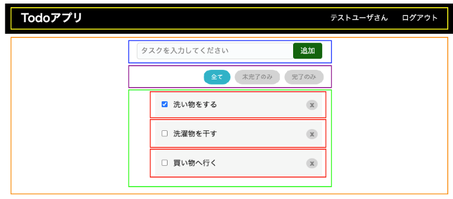
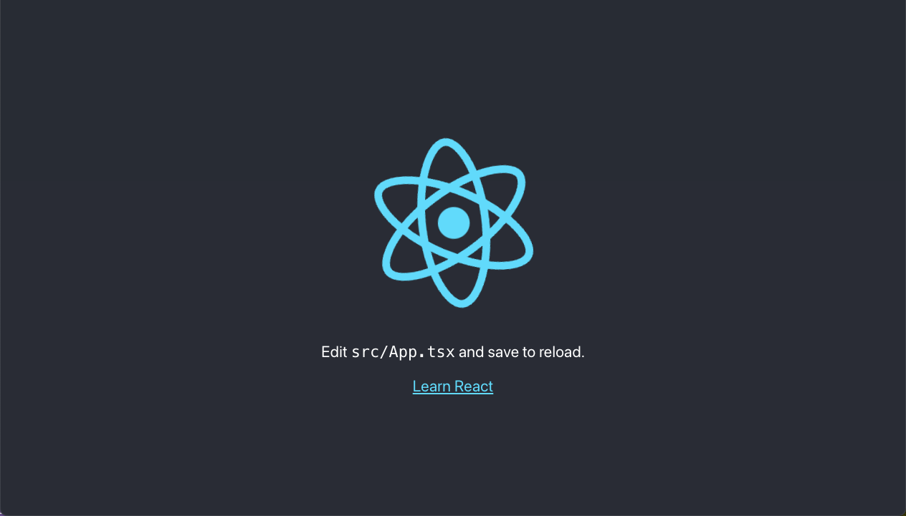

# TypeScript & React 基礎講義資料

## 1. イントロダクション (5分)

### 講義概要

- TypeScriptの環境構築
  - [環境構築用資料](tsEnv.md)
- TypeScript と React の基礎を解説
- 他の言語との比較
- React の環境構築と基礎コンポーネント
- 演習：既存のHTMLページをReactで動かす

---

## 2. TypeScript の基礎 (10分)

### TypeScriptとは？

- 型付けされたJavaScriptのスーパーセット
- 静的型チェックの導入により、エラーの早期発見が可能
- 主要な利点:
  - 型推論、インターフェース、型安全な開発

### 他の言語との比較

- **JavaScript**:
  - 動的型付け、実行時にエラーが発生しやすい
- **Java**:
  - 静的型付けだが、冗長な型宣言が必要
- **Python**:
  - 動的型付けで柔軟だが、大規模プロジェクトでは型の明確化が難しい

### 代表的な特徴

- **型アノテーション**
  
    ```typescript
    let age: number = 30;
    let name: string = "John";
    ```

- **インターフェース**

    ```typescript
    interface Person {
      name: string;
      age: number;
    }
    let person: Person = { name: "John", age: 30 };
    ```

- **アロー関数**
  - JavaScriptの標準的な関数宣言をより短く書けるシンタックスシュガー
    - プログラミング言語の機能の一部をより簡潔で読みやすくするための書き方や構文のこと
  - `function`キーワードを使わず、簡潔に書ける点が特徴
  - `this`の扱いが従来の関数と異なり、アロー関数内での`this`は親スコープを参照
  - 例:

    ```typescript
    const add = (a: number, b: number): number => a + b;
    ```

  - 従来：
  
    ```ts
    function add(a: number, b: number): number {
      return a + b;
    }
    ```

  - **従来の関数との違い**:
    - アロー関数は`this`の文脈を保持し、特にコールバック内で便利
      - 従来のJS関数（`function`で定義）：呼び出し方によって`this`の参照が異なる
      - アロー関数：アロー関数の親スコープで固定される

    ```typescript
    const obj = {
      name: "Alice",
      greet: function() {
        setTimeout(function() {
          console.log(`Hello, ${this.name}`);
        }, 1000);
      }
    };

    obj.greet(); // "undefined" が出力

    const obj2 = {
      name: "Bob",
      greet: function() {
        setTimeout(() => {
          console.log(`Hello, ${this.name}`);
        }, 1000);
      }
    };

    obj2.greet(); // "Hello, Bob" が出力
    ```

- **関数の定義方法の変化**
  - 最近、JavaScriptやTypeScriptでは、関数を const を使って変数として定義するスタイルが一般的になってきています。これは、関数も変数の一種であるという考え方に基づいています。この手法は、特にアロー関数と組み合わせて使うことが多いです。
  - 従来；

    ```ts
    function add(a: number, b: number): number {
      return a + b;
    }
    ```

  - `const`とアロー関数；

    ```ts
    const add = (a: number, b: number): number => {
      return a + b;
    };
    ```


---

## 3. React の基礎 (10分)

### React とは？

- UI構築のためのJavaScriptライブラリ
- コンポーネントベースで再利用可能なUI部品を作成
- Virtual DOM による効率的な描画

コンポーネント例：



### 他のフロントエンドフレームワークとの比較

- **Vue.js**:
  - テンプレートベースで学習コストが低いが、企業導入率ではReactが上
- **Angular**:
  - フルスタックフレームワークで、構造が堅牢だがReactより複雑

### React の代表的な特徴

- **関数コンポーネント**

    ```jsx
    const Hello = () => <h1>Hello, world!</h1>;
    ```

- **JSX (JavaScript XML)**

    ```jsx
    const App = () => <div>Hello, {user.name}!</div>;
    ```

- **Hooks**

    ```jsx
    import { useState } from 'react';

    const Counter = () => {
      const [count, setCount] = useState(0);
      return (
        <div>
          <p>{count}</p>
          <button onClick={() => setCount(count + 1)}>Increment</button>
        </div>
      );
    };
    ```

---

## 4. 環境構築 (15分)

### TypeScript と React の環境構築

1. **Node.js のインストール**
   - [Node.js公式サイト](https://nodejs.org)からダウンロードしインストール

2. **Create React App (CRA) でプロジェクト作成**

   ```bash
   npx create-react-app my-app --template typescript
   cd my-app
   npm start
   ```

   - `npx create-react-app` はReactアプリケーションを簡単に作成するCLIツール
   - 以下の画面が出たら成功
  
  

3. **必要な依存関係の追加**
   - `react`, `react-dom`は自動的にインストールされる
   - 型定義の追加 (CRAを使う場合は自動で設定される)

     ```bash
     npm install --save typescript @types/react @types/react-dom
     ```

### TypeScriptのコンパイル設定
- `tsconfig.json`でTypeScriptのコンパイルオプションを設定する
  ```json
  {
    "compilerOptions": {
      "target": "es6",
      "jsx": "react-jsx",
      "strict": true
    }
  }
  ```

---

## 5. React コンポーネントの基礎 (10分)

### コンポーネントの基礎

- **関数コンポーネント**

    ```tsx
    const Greeting: React.FC = () => <h1>Hello, React!</h1>;
    export default Greeting;
    ```

- **Props を使ったコンポーネント**

    ```tsx
    interface GreetingProps {
      name: string;
    }

    const Greeting: React.FC<GreetingProps> = ({ name }) => {
      return <h1>Hello, {name}!</h1>;
    };
    ```

### 状態管理（useState）

```tsx
import { useState } from 'react';

const Counter: React.FC = () => {
  const [count, setCount] = useState(0);

  return (
    <div>
      <p>{count}</p>
      <button onClick={() => setCount(count + 1)}>Increment</button>
    </div>
  );
};
```

### イベント処理

```tsx
const handleClick = () => {
  alert('Button clicked!');
};

return <button onClick={handleClick}>Click me</button>;
```

---

## 6. 演習 (30分)

### 演習課題: 既存のHTMLページをReactで動かす

#### 手順

1. **HTMLファイルをReactコンポーネントに変換**
   - 例えば以下のHTMLをコンポーネント化する

     ```html
     <div>
       <h1>Hello, World!</h1>
       <p>Welcome to the simple homepage.</p>
     </div>
     ```

2. **既存のHTMLコードをReactコンポーネントに変換**
   - `src/App.tsx`に以下を実装

   ```tsx
   import React from 'react';

   const App: React.FC = () => {
     return (
       <div>
         <h1>Hello, World!</h1>
         <p>Welcome to the simple homepage.</p>
       </div>
     );
   };

   export default App;
   ```

3. **Reactで動かせるようにする**
   - Reactコンポーネントでページを構築し、状態管理やイベント処理を追加してインタラクティブにする

### 発展課題 (オプション)
- **イベントを追加してみる**
   - ボタンを追加し、クリックするとメッセージを変更する
   ```tsx
   import React, { useState } from 'react';

   const App: React.FC = () => {
     const [message, setMessage] = useState('Welcome to the simple homepage.');

     const handleClick = () => {
       setMessage('Button clicked! Message updated.');
     };

     return (
       <div>
         <h1>Hello, World!</h1>
         <p>{message}</p>
         <button onClick={handleClick}>Click me</button>
       </div>
     );
   };

   export default App;
   ```

---

## 7. 質疑応答 & まとめ (10分)

- ReactとTypeScriptのメリットの確認
- よくあるエラーとその解決方法
- 今後の学習ポイント
